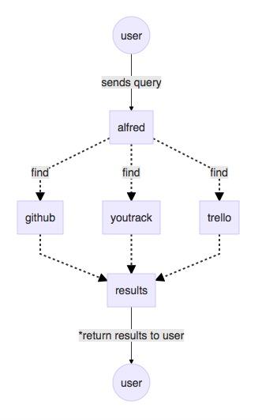

## Go Alfred

You have stuffs in multiple places; github, trello, youtrack, etc. Instead of visiting those endpoints one by one, you want to have single endpoint that can look up anything for your, across those endpoints. Enter: Go Alfred.



#### Usage

Below example will send a search query with term "hello" to trello and github endpoints.

```go
import (
    "github.com/wzulfikar/go-alfred/finder/github"
    "github.com/wzulfikar/go-alfred/finder/trello"
    alfred "github.com/wzulfikar/go-alfred"
)
	
// initialize your finders. you can code your own finders
// or use finders provided in `finder/` directory.
finders := []contracts.Finder{
	&trello.TrelloFinder{
		Key:   config.TrelloKey,
		Token: config.TrelloToken,
	},
	&github.GithubFinder{
		Token: config.GithubToken,
	},
}

finder, err := alfred.New(finders, nil)
if err != nil {
	log.Fatal(err)
}

maxResults := 50
results, err := bot.Alfred.Find("hello", maxResults)
if err != nil {
	log.Println("error fetching results:", err)
}

log.Println(results)
```

*–– End of file*
